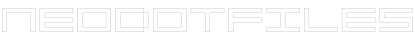
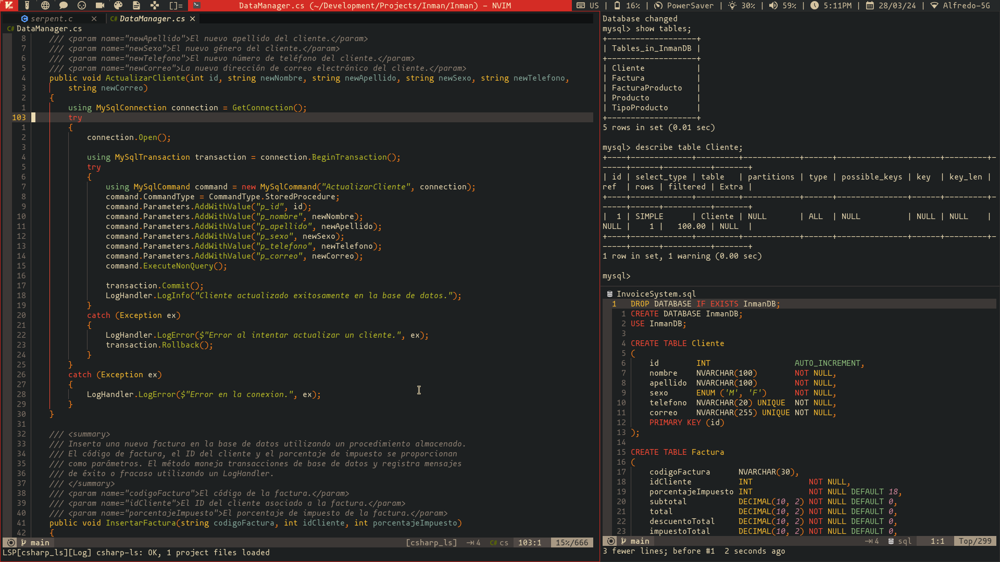

<h1 align="center">
  
</h1>

<h4 align="center">My custom suckless based desktop focused on absolute productivity and workflow control.</h4>



## Key Features

### dwm features
* **A bunch of extra layouts**
    - *Default ones:*
        - master & stack.
        - floating.
        - monocle
    - *Added ones:*
        - dwindle.
        - spiral.
        - centered master (also known as three column).
        - centered floating master (master window floating at the center of the screen, stack on the back).
        - grid.
* **Keychord based keybindings:** Just like emacs, you can have chained keybindings, which exponentially extends the amount of keybindings you can have.
* **Scratchpad support:** Convenient scratchpad functionality for storing and retrieving frequently used applications.
* **Tag based workflow**
    - Each tag (also called workspaces) is meant to have it's purpose, this is achieved with an extensive set of window rules:
        - *Tag 1:* Coding
        - *Tag 2:* Testing
        - *Tag 3:* Web browsing
        - *Tag 4:* Chatting
        - *Tag 5:* Audio tools
        - *Tag 6:* Video tools
        - *Tag 7:* Graphic tools
        - *Tag 8:* Office & Document tools
        - *Tag 9:* Gaming

### Other suckless utilities included
 - *dmenu:* the best run launcher. This build includes some very useful scripts for things like wifi, bluetooth and wallpaper configuration, drive mounting, etc.
 - *herbe & tiramisu:* a minimal and fast notification daemon (tiramisu is the daemon, herbe is the notification window).
 - *st:* the fastest terminal emulator ever, [siduck's build](https://github.com/siduck/st).
 - *slock:* simple and efficient lock screen with fingerprint reader support.
 - *dwbmlocks:* what enables you to customize dwm's status area in the bar. This build includes some cool & customizable status scripts.

## Installation & How To Modify

Make sure to have these dependencies installed in your system:

* **Build dependencies**

```
libX11-devel
libXft-devel
libXrender-devel
libXinerama-devel
libXrandr-devel
libXext-devel
imlib2-devel
harfbuzz-devel
fontconfig-devel
gd-devel
pam-devel
libnotify
xinit
make
gcc
vala
```

* **Runtime dependencies** (required for dmenu scripts)

```
fd
feh
xdpyinfo
xdotool
ffmpeg
maim
slop
udisks2
bluez-utils
j4-dmenu-desktop
NetworkManager
power-profiles-daemon
```

After installing them with your package manager of choice, you can do the following to get the source code and start to modify it to your liking.

```bash
# Clone this repository
$ git clone https://github.com/d4r1us-drk/neodotfiles.git

# Go into the repository
$ cd neodotfiles

# Select which project to compile & install (dwm in this case)
$ cd source/dwm

# To install
$ sudo make install && make clean
```

This repository is not a tutorial on how to modify or configure dwm or any of the included suckless tools, you obviusly don't need to learn C to do this, with this build you can start with an usable base and you wont even need to patch anything. If you want to add a patch though, you will need to do this manually, because most patching utilities like `patch` and `git apply` will fail due to how much of the code base I modified myself.

To configure my build, the only file you really need to modify is the `config.h` file in each tool, which has everything commented and explained. Of course this being *my* build, it is already configured for my needs.

## dwm patch list

These are the patches I applied to this dwm build (some of them I modified):

- adjacenttag
- alpha
- alwayscenter
- attachbottom
- autostart
- barpadding
- centeredmaster
- clientindicators
- combo
- cyclelayouts
- fibonacci
- focusmaster-return
- fullscreen
- gridmode
- keychord
- movestack
- pertag
- restartsig
- rmaster
- scratchpads
- statuspadding
- sticky
- stickyindicator
- tag-preview
- tapresize
- truecenteredtitle
- warp
- winicon

## Credits

- dwm and the suckless tools available here are made by the suckless guys at [https://suckless.org](https://suckless.org).
- herbe is made by dudik and available [here](https://github.com/dudik/herbe).
- tiramisu is made by Sweets and available [here](https://github.com/Sweets/tiramisu).
- dwmblocks is made by torrinfail and available [here](https://github.com/torrinfail/dwmblocks)

## License

This project is licenced under the MIT License

