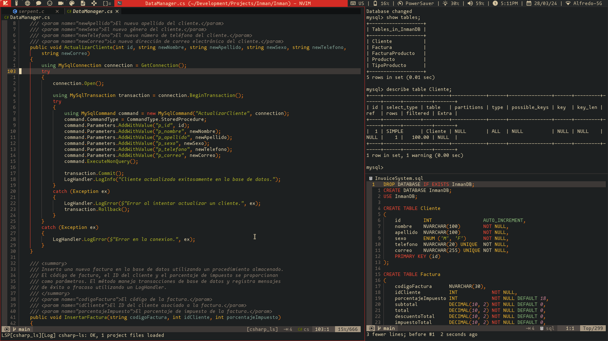

<h1 align="center">
  
</h1>

<h4 align="center">My custom build of the blazing fast and amazing <a href="https://dwm.suckles.org" target="_blank">dwm</a> tiling window manager, made for absolute productivity and workflow control.</h4>



## Key Features

* A bunch of extra layouts
    - *Default ones:*
        - master & stack.
        - floating.
        - monocle
    - *Added ones:*
        - dwindle.
        - spiral.
        - centered master (also known as three column).
        - centered floating master (master window floating at the center of the screen, stack on the back).
        - grid.
* Keychord based keybindings
    - Just like emacs, you can have chained keybindings, which exponentially extends the amount of keybindings you can have.
* Scratchpad support
    - Convenient scratchpad functionality for storing and retrieving frequently used applications.
* Tag based workflow
    - Each tag (also called workspaces) is meant to have it's purpose, this is achieved with an extensive set of window rules:
        - *Tag 1:* Coding
        - *Tag 2:* Testing
        - *Tag 3:* Web browsing
        - *Tag 4:* Chatting
        - *Tag 5:* Audio tools
        - *Tag 6:* Video tools
        - *Tag 7:* Graphic tools
        - *Tag 8:* Office & Document tools
        - *Tag 9:* Gaming
* And much more...

## Installation & How To Modify

Make sure to have these dependencies installed in your system:

```
libX11-devel
libXft-devel
libXrender-devel
libXinerama-devel
imlib2-devel
fontconfig-devel
xinit
make
gcc
```

After installing them with your package manager of choice, you can do the following to get the source code and start to modify it to your liking.

```bash
# Clone this repository
$ git clone https://github.com/d4r1us-drk/dwm.git

# Go into the repository
$ cd dwm

# To compile
$ make

# To install
$ sudo make install && make clean
```

This repository is not a tutorial on how to modify or configure dwm, you obviusly don't need to learn C to do this, with this build you can start with an usable base and you wont even need to patch anything. If you want to add a patch though, you will need to do this manually, because most patching utilities like `patch` and `git apply` will fail due to how much of the code base I modified myself.

To configure my build, the only file you really need to modify is the `config.h` file, which has everything commented and explained. Of course this being *my* build, it is already configured for my needs.

## Patch list

These are the patches I applied to this build (some of them I modified):

- adjacenttag
- alpha
- alwayscenter
- attachbottom
- autostart
- barpadding
- centeredmaster
- clientindicators
- combo
- cyclelayouts
- fibonacci
- focusmaster-return
- fullscreen
- gridmode
- keychord
- movestack
- pertag
- restartsig
- rmaster
- scratchpads
- statuspadding
- sticky
- stickyindicator
- tag-preview
- tapresize
- truecenteredtitle
- warp
- winicon

## Credits

dwm is made by the suckless guys at [https://suckless.org](https://suckless.org)

## License

This project is licenced under the MIT License

